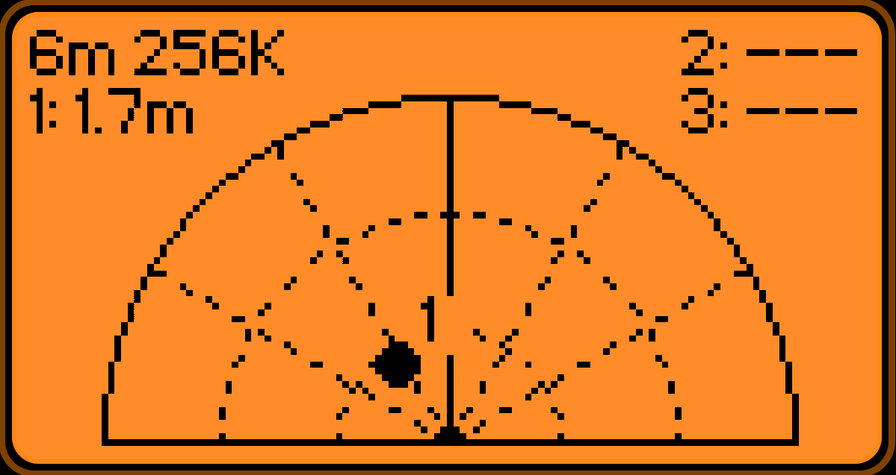
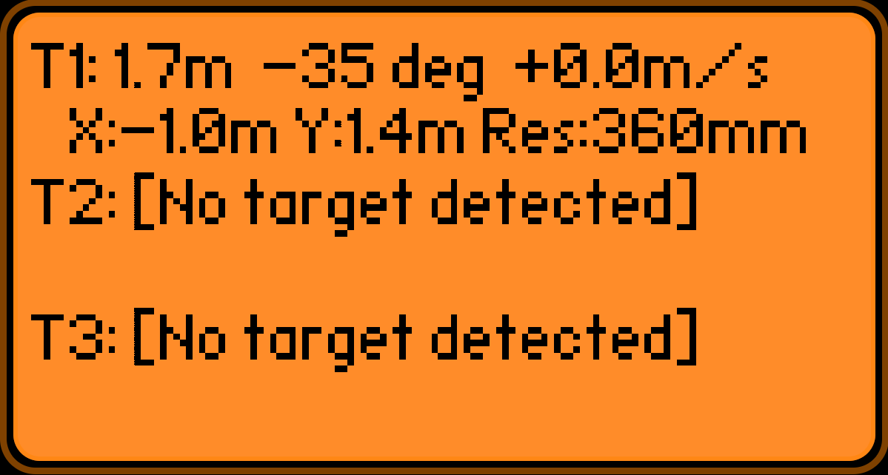
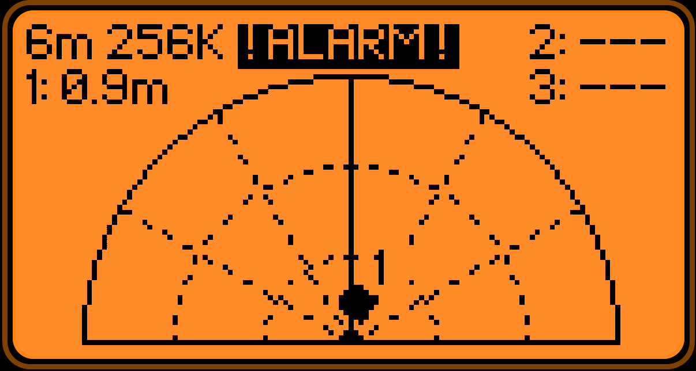

# Flipper Zero HLK-LD2450 24GHz mmWave Radar Tracker & Visualizer

A 2D radar visualizer, multi-target tracking, and perimeter security application for the **Flipper Zero** interfaced with the **Hi-Link HLK-LD2450** 24GHz mmWave radar sensor.

<p align="center">      </p>

---

## Features

- **2D Radar View:**
  - Full-height semicircular radar display with range rings and angle sector lines (0°, ±30°, ±60°).
  - 4 Zoom levels: **2m (7ft)**, **4m (13ft)**, **6m (20ft)**, and **8m (26ft)**.

- **Perimeter Security System:**
  - Audible proximity security monitoring using Flipper Zero's internal speaker.
  - **4 Operational Modes:**
    - **`OFF`**: Security monitoring disabled, speaker released.
    - **`Notification`**: Moderate short tone (90ms, 30% vol) upon target entry with distinct musical frequencies per target:
    - **`Alert`**: Louder, longer rising two-tone chirp (240ms, 85% vol) upon target entry with distinct tones per target:
    - **`Alarm`**: Rapid alternating warble siren (880 Hz / 1320 Hz, 90% vol) that continuously sounds as long as any target is detected within the zoom range, stopping only after the monitored space is completely cleared.
    
- **Detailed Target Tracking View:**
  - Individual target readouts (T1, T2, T3) with clean vertical line spacing.
  - Displays Euclidean distance, angle (degrees), forward/lateral coordinates (X, Y), speed (approaching/receding), and distance resolution.

- **Robust Frame Parser & Auto-Baud Detection:**
  - Supports Multi-Target tracking (3 targets, 30-byte frames: `AA FF 03 00 ... 55 CC`).
  - Supports Single-Target tracking (1 target, 14-byte frames: `AA FF 01 00 ... 55 CC`).
  - Automatically identifies sensor baud rate (256000, 115200, etc.) and locks in once valid packets are verified.

---

## Wiring Diagram

Connect the HLK-LD2450 sensor to the Flipper Zero GPIO header:

| HLK-LD2450 Pin | Flipper Zero Pin | Note |
| :--- | :--- | :--- |
| **VCC** | **5V (Pin 1)** | 5V rail (automatically powered via USB or OTG on battery) |
| **GND** | **GND (Pin 8 / 11 / 18)** | Ground |
| **TX** | **RX (Pin 14 / USART RX)** | Radar sensor TX connects to Flipper RX |
| **RX** | **TX (Pin 13 / USART TX)** | Radar sensor RX connects to Flipper TX |

---

## Installation & Build

Using **uFBT** (Micro Flipper Build Tool):

1. Connect your Flipper Zero via USB.
2. Build and launch:
   ```bash
   ufbt launch
   ```
   Or build standalone `.fap` package:
   ```bash
   ufbt
   ```
   The `.fap` binary will be located in `dist/ld2450_radar.fap`.

---

